# Architecture and reproducibility

```mermaid
flowchart LR
  S["Earth Search STAC item IDs"] --> C["Sentinel-2 public COG windows"]
  W["WorldCover 2021 public COGs"] --> A["EPSG:3067 / 10 m aligned grid"]
  C --> A
  A --> M["SCL + no-data mask"]
  M --> P["64×64 non-overlapping patches"]
  P --> G["Held-out AOI split + leakage gates"]
  G --> D["PyTorch Dataset / DataLoader"]
  D --> T["Explicit U-Net / TinyDeepLab training"]
  T --> F["MLflow + validation selection"]
  F --> E["One locked Oulu evaluation"]
  E --> R["Error / calibration / risk evidence"]
  E --> I["1.9 MB CPU model artifact"]
  I --> API["Validated FastAPI GeoTIFF inference"]
```

CRS changes are not hidden: `geo/raster.py` transforms WGS84 AOI bounds, snaps the outer target to EPSG:3067 multiples of 10 and requires a resampling enum at each raster read. `data/build.py` visibly chooses bilinear for reflectance and nearest for SCL/WorldCover.

The manifest records dataset/split/class-map versions, AOI geometry, source and target CRS, scene IDs and dates, cloud metadata, source URLs, bands, resampling, resolution, patch bounds/split/class counts, content hashes, normalization, generation time, config hash and code commit. Raw and processed rasters never enter Git.

The final 1.9 MB checkpoint records model schema, state dict, architecture, bands, class map, normalization, dataset/split digest, validation metrics, selected epoch, PyTorch version, CPU device, MLflow run ID, validation-fit temperature, held-out metrics and evaluation timestamp.
